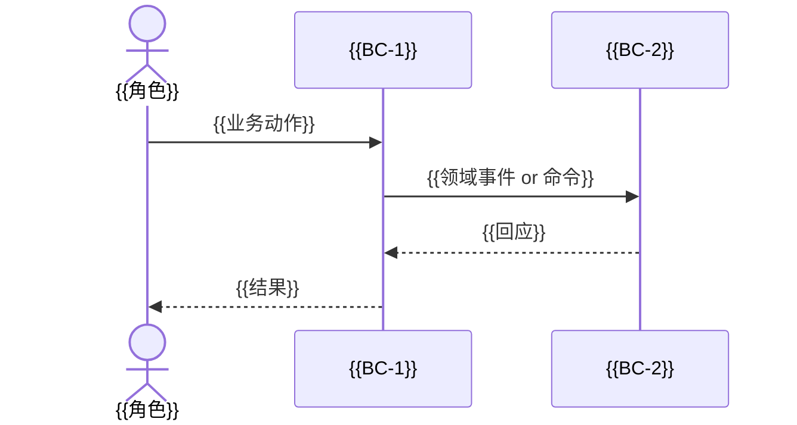
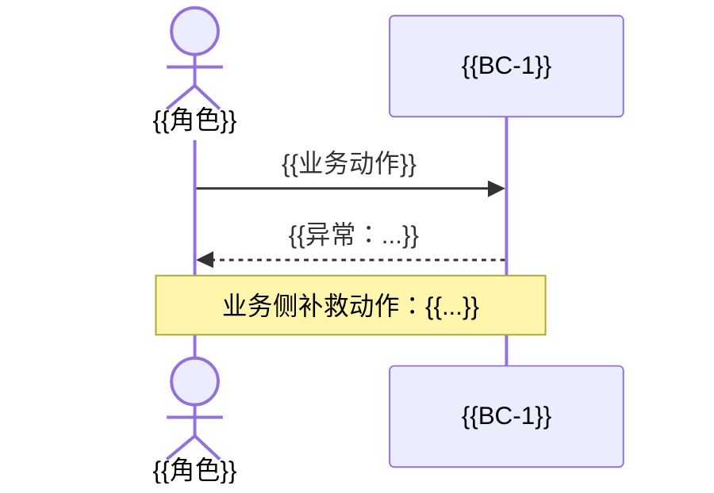

# {{产品/Feature 名称}} 业务与领域设计

> 派生自：`{{PRD 文件相对路径}}`
> 范围声明：见第 3 节
> 文档版本：v1.0 · {{YYYY-MM-DD}}
> 演进自（维护模式必填，首次跑写"无"）：{{上一版 feature-slug @ commit hash}}

## 0. 变更记录

> 首次跑：本节内容为"首次落盘，无变更记录"。维护模式：每次维护跑必须追加新行；条目数与 M1 影响矩阵 1:1。

| 日期 | 变化来源（PRD 章节 / 触发原因） | 类型（澄清/修改/新增/废弃/重命名） | 影响章节 | 简述 |
|------|------------------------------|----------------------------------|---------|------|
| {{YYYY-MM-DD}} | {{PRD §X.X}} | {{...}} | {{§N / §M}} | {{...}} |

## 1. 业务背景与目标

### 1.1 业务背景

{{2-4 句话描述业务背景，用业务方语言，不涉及技术。}}

### 1.2 业务目标

| # | 业务诉求 | 衡量方式 |
|---|---------|---------|
| 1 | {{诉求 1}} | {{如何衡量是否达成}} |
| 2 | {{诉求 2}} | {{...}} |
| 3 | {{诉求 3}} | {{...}} |

### 1.3 商业价值

{{1-2 段：本次工作对业务方的价值，包括但不限于：用户体验、运营效率、合规、收入。}}

## 2. 利益相关者与角色

| 角色 | 类型 | 职责/关注点 |
|------|------|-------------|
| {{角色 1}} | 内部用户 / 外部用户 / 系统角色 | {{...}} |
| {{角色 2}} | ... | ... |

## 3. 范围声明

### 3.1 In-Scope（本次必须覆盖）

- {{条目 1}}
- {{条目 2}}
- ...

### 3.2 Out-of-Scope（明确不做）

- {{条目 1}} —— 原因：{{为什么不做}}
- {{条目 2}} —— 原因：{{...}}

## 4. 子域分类

| 子域 | 类型 | 理由 |
|------|------|------|
| {{子域 A}} | 核心域 | {{业务差异化点；公司核心竞争力所在}} |
| {{子域 B}} | 支撑域 | {{支撑核心域必需，但非差异点}} |
| {{子域 C}} | 通用域 | {{行业通用，可考虑外购/开源}} |

## 5. 限界上下文与上下文映射

### 5.1 限界上下文清单

| 限界上下文 | 所属子域 | 一句话语言模型 |
|-----------|---------|---------------|
| {{BC-1}} | 核心域 / 支撑域 / 通用域 | {{在这个上下文里，"X" 表示...}} |
| {{BC-2}} | ... | ... |

### 5.2 上下文映射图

```mermaid
graph LR
    BC1[{{BC-1}}] -->|{{关系类型}}| BC2[{{BC-2}}]
    BC2 -->|防腐层| BC3[{{BC-3}}]
    %% 关系类型：共享内核 / 客户-供应方 / 防腐层(ACL) / OHS / Conformist / Separate Ways
```

### 5.3 关键交互说明

| 上游 | 下游 | 关系类型 | 说明 |
|------|------|---------|------|
| {{BC-X}} | {{BC-Y}} | {{...}} | {{为什么是这种关系；要传递什么信息}} |

### 5.4 各 BC 能力清单

> 把每个 BC 能"做什么"以**能力单元**粒度列清楚。每条能力一行，六要素必填，缺一即自审失败。这一表为下游单 Feature 规格化工具（如 Speckit 体系的 `speckit-specify` / 项目自研入口）派生用户故事时提供结构化输入；同时让限界上下文不止停留在"领域分类"层面，而是有可消费的能力可见性。

| BC | 能力 | 输入 | 输出 | 规则 | 状态 | 异常 | 依赖 |
|----|------|------|------|------|------|------|------|
| {{BC-1}} | {{能力 X}} | {{触发动作 / 上游事件 / 携带数据}} | {{副作用 / 返回值 / 触发的下游事件}} | {{R# 关联业务规则}} | {{影响的聚合根状态转移}} | {{失败码或拒绝条件}} | {{下游 BC / 系统能力 / 外部依赖}} |
| {{BC-1}} | {{能力 Y}} | ... | ... | ... | ... | ... | ... |
| {{BC-2}} | {{能力 Z}} | ... | ... | ... | ... | ... | ... |

> "能力"按用户视角的可感知功能粒度命名（如"提交下载任务""查询已授权敏感权限"），不要写成实现术语（"调用 X Repository""查表 Y"）。

## 6. 聚合根、实体与值对象

### 6.1 {{聚合根 1 名称}}

- **聚合边界**：包含 `{{实体A, 实体B, 值对象C}}`
- **不变式**：
  - {{业务约束 1}}
  - {{业务约束 2}}
- **生命周期**：{{何时创建 / 何时归档 / 何时销毁}}

### 6.2 {{聚合根 2 名称}}

...

## 7. 领域事件

| 事件名（过去式） | 触发条件 | 携带信息 | 订阅方（限界上下文） |
|-----------------|---------|---------|---------------------|
| {{XX已YY}} | {{聚合根状态从 A→B 时}} | {{聚合根 ID, 关键字段}} | {{BC-1, BC-2}} |
| ... | ... | ... | ... |

## 8. 业务规则与不变式

| # | 规则 | 类型 | 关联聚合根 |
|---|------|------|-----------|
| R1 | {{当...时，必须/不能/仅当...}} | 不变式 / 前置条件 / 后置条件 | {{聚合根名}} |
| R2 | ... | ... | ... |

> 每条规则必须可被代码断言（即能写成 `require/check`）。

## 9. Ubiquitous Language（统一术语表）

| 术语 | 定义 | 类型 | 所属上下文 |
|------|------|------|-----------|
| {{术语 1}} | {{业务定义，不含实现}} | 聚合根 / 实体 / 值对象 / 领域事件 / 业务概念 | {{BC-X}} |
| {{术语 2}} | ... | ... | ... |

> 同一英文/中文词在不同上下文若有不同含义，必须分别列出并标注上下文。

## 10. 业务流程

### 10.1 {{核心流程名 — Happy Path}}



### 10.2 {{关键异常路径}}



### 10.3 场景-行为联动表

> 识别每个**关键场景变化**对四类系统行为的连锁影响。任何一个关键场景如果没有任何一格被填，要么场景描述含糊、要么遗漏分析；都视为自审失败。这一表是防止下游实现阶段"漏改 UI / 接口 / 缓存 / 权限"的最有效工程手段。

| 关键场景 | UI 影响 | 接口影响 | 缓存影响 | 权限影响 |
|---------|---------|---------|---------|---------|
| {{场景 1：用户协议版本变更}} | {{弹重签弹窗}} | {{platform-api 拉取新协议}} | {{清空 BC-AppCatalog 缓存}} | {{敏感权限授权可能失效}} |
| {{场景 2：进入高并发场景（导航/投屏/Local360）}} | {{toast + 关闭}} | {{停止待处理网络请求}} | {{保留缓存待恢复}} | {{无影响}} |
| {{场景 3：...}} | ... | ... | ... | ... |

> 至少覆盖：授权状态变化 / 网络可用性变化 / 座舱场景切换（高并发 / 走行限制 / STR）/ 应用上下架 / 协议版本变更 / 任何 PRD 中"必须"句式描述的状态切换。

## 11. 派生与追溯

| PRD 元素 | 本文档对应位置 |
|---------|---------------|
| {{PRD 1.1 节"用户登录"}} | 第 5.1 节 BC-Auth |
| {{PRD 2.3 节"购物车"}} | 第 6.1 节 聚合根 ShoppingCart |
| ... | ... |

> 用此表证明 PRD 的每个业务元素都已被建模，反之亦然（无凭空增加）。
