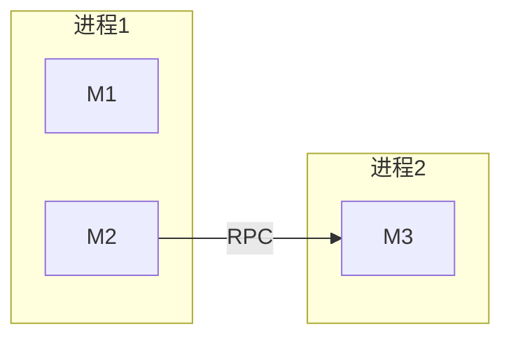

# {{产品/Feature 名称}} 软件概要设计

> 派生自：
> - `persistent-assets/design/_baseline/00-业务与领域设计.md`
> - `{{PRD 文件相对路径}}`
>
> 文档版本：v1.0 · {{YYYY-MM-DD}}
> 演进自（维护模式必填，首次跑写"无"）：{{上一版 feature-slug @ commit hash}}

## 0. 变更记录

> 首次跑：本节内容为"首次落盘，无变更记录"。维护模式：每次维护跑必须追加新行；条目数与 M1 影响矩阵 1:1。

| 日期 | 变化来源（PRD 章节 / 触发原因） | 类型（澄清/修改/新增/废弃/重命名） | 影响章节 | 简述 |
|------|------------------------------|----------------------------------|---------|------|
| {{YYYY-MM-DD}} | {{PRD §X.X}} | {{...}} | {{§N / §M}} | {{...}} |

## 1. 设计目标与原则

### 1.1 设计目标

| # | 目标 | 来源 |
|---|------|------|
| G1 | {{...}} | 业务诉求 / NFR / 既有约束 |
| G2 | ... | ... |

### 1.2 设计原则

- {{如：单一真理源 / 模块边界 = 限界上下文 / 接口优先内部稳定 ...}}

## 2. 技术栈选型

### 2.1 备选方案对照

| 方案 | 关键技术 | 满足的目标 | 不满足的目标 | 引入成本 |
|------|---------|-----------|-------------|---------|
| A（推荐） | {{...}} | {{G1, G3}} | {{G5（已评估为可接受）}} | {{...}} |
| B | {{...}} | {{...}} | {{...}} | {{...}} |
| C | {{...}} | {{...}} | {{...}} | {{...}} |

### 2.2 推荐方案与理由

**推荐：方案 A**

理由：
- {{核心理由 1}}
- {{核心理由 2}}

**不选 B 的关键原因**：{{...}}
**不选 C 的关键原因**：{{...}}

## 3. 架构风格

**采用**：{{单体 / 模块化单体 / 微服务 / 事件驱动 / 分层 / 六边形 / ...}}

**反驳替代风格**：

| 替代 | 为什么不选 |
|------|-----------|
| {{...}} | {{...}} |

## 4. 系统视图（C4）

### 4.1 Context 视图（系统与外部的关系）

```mermaid
flowchart LR
    User([{{用户}}]) --> SUT[{{本系统}}]
    SUT --> Ext1[{{外部系统 1}}]
    SUT --> Ext2[{{外部系统 2}}]
```

### 4.2 Container 视图（系统内部模块边界）

```mermaid
flowchart TB
    subgraph SUT[{{本系统}}]
        M1[{{模块 1}}]
        M2[{{模块 2}}]
        M3[{{模块 3}}]
        DB[({{存储}})]
        M1 -->|调用| M2
        M2 -->|事件| M3
        M2 --> DB
    end
    M1 --> Ext1[{{外部系统 1}}]
```

## 5. 模块清单

| 模块 | 一句话职责 | 对应限界上下文 | 主要上游依赖 | 主要下游依赖 |
|------|-----------|---------------|-------------|-------------|
| {{M1}} | {{...}} | {{BC-X}} | {{用户}} | {{M2, Ext1}} |
| {{M2}} | {{...}} | {{BC-Y}} | {{M1}} | {{DB, M3}} |
| {{M3}} | {{...}} | {{BC-Z}} | {{M2 事件}} | {{Ext2}} |

> 一个模块必须只对应 1 个限界上下文。如需协调多上下文，单列协调器模块并显式标注。

## 6. 模块间通信

| 上游 → 下游 | 通信方式 | 触发条件 | 失败处理 |
|------------|---------|---------|---------|
| {{M1}} → {{M2}} | 同步调用 / 异步消息 / 共享存储事件 | {{...}} | {{重试 / 降级 / 抛出}} |

## 7. 外部依赖

| 系统名 | 用途 | 协议 | 版本 | SLA | 失败/降级策略 |
|-------|------|------|------|-----|--------------|
| {{Ext1}} | {{...}} | HTTPS REST / gRPC / MQTT | {{v?.?}} | {{99.9%}} | {{熔断 + 本地缓存}} |
| {{Ext2}} | ... | ... | ... | ... | ... |

## 8. 跨切面策略

### 8.1 日志
{{1-3 句话；或"不适用：原因"。}}

### 8.2 监控与可观测性
{{...}}

### 8.3 鉴权与授权
{{...}}

### 8.4 事务与一致性
{{...}}

### 8.5 限流与背压
{{...}}

### 8.6 安全（数据加密 / 输入校验 / 审计）
{{...}}

## 9. 数据存储与一致性

### 9.1 聚合根 → 存储映射

| 聚合根（来自 Stage 1） | 存储 | 存储模型 | 索引策略 |
|----------------------|------|---------|---------|
| {{聚合根 A}} | {{Room / PostgreSQL / Redis}} | {{表/集合/键名}} | {{...}} |

### 9.2 跨聚合一致性

| 涉及聚合 | 一致性级别 | 实现机制 |
|---------|-----------|---------|
| {{A, B}} | 强一致（事务边界） | {{...}} |
| {{B, C}} | 最终一致 | {{Outbox + 消息队列 / Saga / 对账任务}} |

## 10. 部署拓扑



| 部署单元 | 包含模块 | 扩缩容粒度 | 资源需求 |
|---------|---------|-----------|---------|
| {{...}} | {{M1, M2}} | 按 QPS 横向 | {{CPU/内存/存储}} |

## 11. 非功能需求达成路径

| NFR | 目标值 | 设计方案 | 度量方式 |
|-----|-------|---------|---------|
| {{响应时间 P99}} | {{≤200ms}} | {{...缓存 / 索引 / 异步...}} | {{监控指标 + 报警阈值}} |
| {{可用性}} | {{99.9%}} | {{...冗余 / 重试 / 熔断...}} | {{...}} |
| {{吞吐}} | {{...}} | {{...}} | {{...}} |
| {{安全}} | {{...}} | {{...}} | {{审计日志 + 渗透测试}} |

## 12. 关键风险与应对

| # | 风险 | 影响 | 缓解 |
|---|------|------|------|
| R1 | {{...}} | {{高/中/低}} | {{...}} |
| R2 | ... | ... | ... |
| R3 | ... | ... | ... |

## 13. 派生与追溯

| Stage 1 元素 | 本文档对应位置 |
|-------------|---------------|
| 限界上下文 BC-X | 第 5 节 模块 M1 |
| 领域事件 "XX已YY" | 第 6 节 M2→M3 异步消息 |
| 业务规则 R1 | 第 9.2 节 强一致事务边界 |
