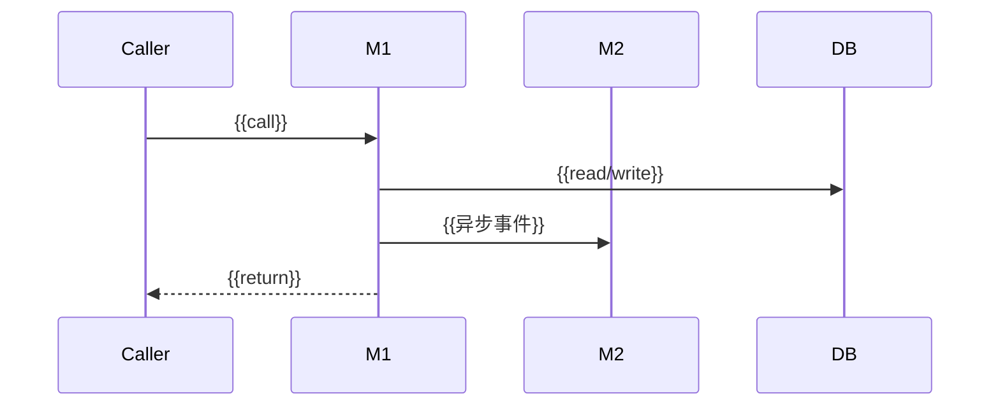
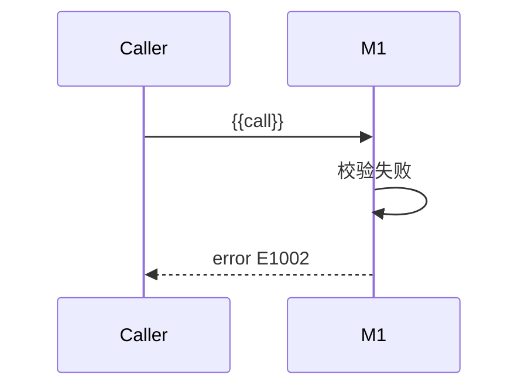

# {{产品/Feature 名称}} 软件详细设计

> 派生自：
> - `persistent-assets/design/_baseline/01-概要设计.md`
> - `persistent-assets/design/_baseline/00-业务与领域设计.md`
>
> 文档版本：v1.0 · {{YYYY-MM-DD}}
> 演进自（维护模式必填，首次跑写"无"）：{{上一版 feature-slug @ commit hash}}

## 0. 变更记录

> 首次跑：本节内容为"首次落盘，无变更记录"。维护模式：每次维护跑必须追加新行；条目数与 M1 影响矩阵 1:1。

| 日期 | 变化来源（PRD 章节 / 触发原因） | 类型（澄清/修改/新增/废弃/重命名） | 影响章节 | 简述 |
|------|------------------------------|----------------------------------|---------|------|
| {{YYYY-MM-DD}} | {{PRD §X.X}} | {{...}} | {{§N / §M}} | {{...}} |

## 1. 总览

### 1.1 模块索引

| 模块 | 章节 | 一句话职责 |
|------|------|-----------|
| {{M1}} | §4.1 | {{...}} |
| {{M2}} | §4.2 | {{...}} |
| {{M3}} | §4.3 | {{...}} |

### 1.2 跨模块约定

- 错误码体系：{{规则；如 `<MODULE>_<E_CODE>` 风格、错误码段位划分}}
- 异常基类：{{...}}
- 日志规范：{{关键字段约定}}
- 指标命名：{{...}}
- Trace 标签：{{...}}
- 时间/时区/编码：{{...}}

### 1.3 通用类型与值对象（多模块共享）

| 类型名 | 性质 | 字段 | 不变式 |
|-------|------|------|-------|
| {{Money}} | 值对象 | amount: BigDecimal, currency: Currency | amount ≥ 0；currency ∈ ISO 4217 |
| ... | ... | ... | ... |

## 2. 命名与约定

- 包/模块路径：{{...}}
- 接口命名风格：{{Verb-Noun / Resource-Action / ...}}
- DTO/Entity/VO 区分：{{...}}

## 3. 全局错误码

| 错误码 | 含义 | HTTP/调用方表现 | 触发模块 |
|-------|------|----------------|---------|
| {{E1001}} | {{...}} | {{4xx/5xx，对应消息}} | {{M1}} |
| ... | ... | ... | ... |

---

## 4. 模块详述

> 以下 4.x 章节为**每个模块**复制填写。Stage 2 模块清单中的全部模块都必须出现，缺一即自审失败。

### 4.1 {{M1 模块名}}

#### 4.1.1 模块概述

**做什么**：{{1-2 段}}
**不做什么**：{{显式排除项，避免与相邻模块责任重叠}}
**对应限界上下文**：{{BC-X}}

#### 4.1.2 依赖清单

| 依赖类型 | 对象 | 同步/异步 | 必选/可选 | 降级路径 |
|---------|------|----------|----------|---------|
| 上游调用方 | {{M0 / 用户}} | 同步 | 必选 | N/A |
| 下游被调用 | {{M2}} | 异步 | 必选 | {{...}} |
| 下游被调用 | {{Ext1}} | 同步 | 必选 | {{熔断 + 缓存}} |
| 共享存储 | {{DB.table_x}} | - | 必选 | N/A |

#### 4.1.3 对外接口契约

##### 接口 1：`{{methodName(args)}} -> ReturnType`

| 要素 | 内容 |
|------|------|
| 接口类型 | 业务接口（领域服务 / UseCase / 进程内调用，单测覆盖）/ API 接口（系统服务 / IPC / AIDL / HTTP / 跨进程或端云边界，集成或契约测试覆盖） |
| 签名 | `fun {{name}}(arg1: T1, arg2: T2): ReturnType` 抛 `XxxException` |
| 前置条件 | {{调用方必须保证 ...}} |
| 后置条件 | {{成功返回时保证 ...}} |
| 错误码 | `E1001 - <原因>`；`E1002 - <原因>` |
| 幂等性 | 是 / 否（说明：基于 `<id>` 去重，重复调用返回相同结果 / 非幂等，需调用方控制） |
| 超时 | {{...}} |
| 重试语义 | 调用方可重试 / 仅在错误码 X 时可重试 / 不可重试 |

##### 接口 2：...

#### 4.1.4 内部行为规约

- 当 `{{条件A}}` 时，必须 `{{动作}}`
- 当 `{{条件B}}` 时，拒绝并返回 `{{错误码}}`
- ...

#### 4.1.5 状态机

```mermaid
stateDiagram-v2
    [*] --> {{State1}}
    {{State1}} --> {{State2}}: {{event/动作}}
    {{State2}} --> {{State3}}: {{event/动作}}
    {{State2}} --> {{Failed}}: {{异常事件}}
    {{State3}} --> [*]
```

| 状态 | entry 动作 | exit 动作 | 允许事件 | 非法事件→处理 |
|------|-----------|----------|---------|--------------|
| {{State1}} | {{...}} | {{...}} | {{event1, event2}} | 其他事件 → 返回 `E1001` |
| ... | ... | ... | ... | ... |

#### 4.1.6 关键时序图

##### Happy Path：{{...}}



##### 异常路径：{{触发 E1002 的场景}}



#### 4.1.7 数据模型

##### 表 `{{table_x}}`

| 字段 | 类型 | 约束 | 说明 |
|------|------|------|------|
| id | BIGINT | PK, AUTO | 主键 |
| {{...}} | {{...}} | {{NOT NULL / UNIQUE / FK→...}} | {{...}} |

**关键索引**：
- `idx_{{x}}` on `({{col1, col2}})` —— 用途：{{...}}

**关键约束**：
- {{业务约束 ↔ 数据库约束的对应}}

#### 4.1.8 并发与一致性

- 锁粒度：{{行/表/无锁}}
- 锁类型：{{悲观 / 乐观（版本号字段 `version`）}}
- 事务边界：{{方法 X 内开始-提交 / 跨方法（Saga/Outbox）}}
- 重入：{{允许 / 不允许；不允许时的检测机制}}

#### 4.1.9 可观测性埋点

| 关键路径 | 埋点形式 | 关键字段/标签 |
|---------|---------|--------------|
| {{接口调用}} | 日志 INFO + 指标 counter | request_id, user_id, latency_ms |
| {{异常分支}} | 日志 ERROR + 指标 counter | error_code, root_cause |
| {{...}} | Trace span | span name, attributes |

#### 4.1.10 模块级风险与回退

| 风险 | 影响 | 回退策略 |
|------|------|---------|
| {{...}} | {{...}} | {{...}} |

---

### 4.2 {{M2 模块名}}

> 复制 4.1 子章节结构填写

---

### 4.3 {{M3 模块名}}

> 复制 4.1 子章节结构填写

---

## 5. 派生与追溯

| HLD 元素 | DLD 对应位置 |
|---------|-------------|
| 模块 M1 | §4.1 |
| 模块间通信 M1→M2 | §4.1.2 依赖清单 + §4.1.6 时序图 |
| 外部依赖 Ext1 | §4.1.2 + §4.1.10 |
| 错误码体系 | §3 + 各接口契约 |

| Stage 1 元素 | DLD 对应位置 |
|-------------|-------------|
| 聚合根 A | §4.1.7 数据模型 |
| 业务规则 R1 | §4.1.4 行为规约 |
| 领域事件 "XX已YY" | §4.1.6 时序图 + §4.1.3 接口 |
| 状态：A→B | §4.1.5 状态机 |
